We took the whole weekend off. Friday was a strong sourcing day, the shed was already full of unlisted stuff, and going out Saturday would've felt greedy. So we left the garage sales to other people for two days — and Monday morning, the pull-orders list was *long*. Twenty-seven orders. Sold on all four platforms. Even Etsy was on fire.

This post walks through every single sale from that morning's batch — what it was, what it sold for, where it sold, and the small story attached to it. The cards below are pulled directly from the video so you can see exactly what each listing looked like.

## The setup — Friday source, weekend off, Monday pull

The whole reason this haul looks the way it does is the cadence. We hit it hard on Friday — neighborhood sales, estate sales, the usual rotation — and came home with enough that taking the weekend off didn't feel reckless. Candice went camping with her Girl Scout troop. I worked on some other shed projects. We let the inventory we already had in the death pile do the selling.

By Monday morning, twenty-seven orders had stacked up across the four platforms. That's the kind of day that makes a slow-sourcing weekend pay for itself.

## The eBay haul (24 orders)

Most of the volume was on eBay, like always.

<figure class="sold-item">
  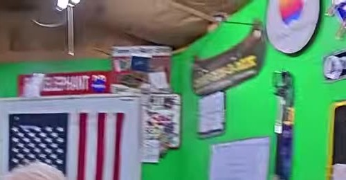
  <figcaption>
    eBay
    Lot of 25 35mm Film Theatrical Movie Theater Preview Trailers
    $74.99
  </figcaption>
</figure>

<figure class="sold-item">
  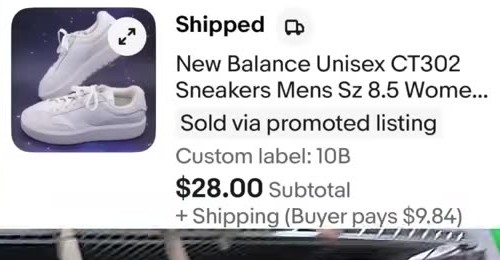
  <figcaption>
    eBay
    New Balance Unisex CT302 Sneakers, Mens Sz 8.5
    $28.00
  </figcaption>
</figure>

<figure class="sold-item">
  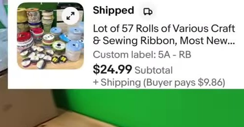
  <figcaption>
    eBay
    Lot of 57 Rolls of Various Craft &amp; Sewing Ribbon
    $24.99
  </figcaption>
</figure>

<figure class="sold-item">
  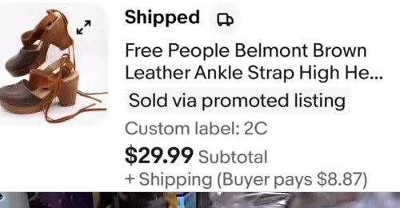
  <figcaption>
    eBay
    Free People Belmont Brown Leather Ankle Strap High Heels
    $29.99
  </figcaption>
</figure>

<figure class="sold-item">
  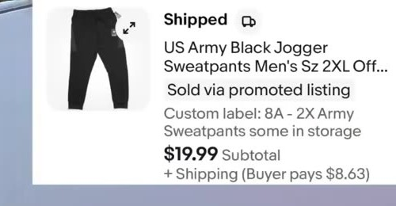
  <figcaption>
    eBay
    US Army Black Jogger Sweatpants, Men's Sz 2XL
    $19.99
  </figcaption>
</figure>

<figure class="sold-item">
  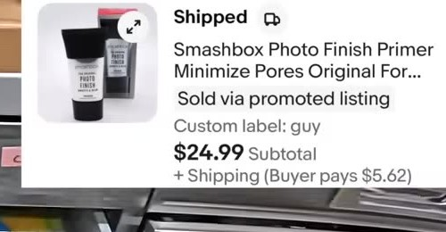
  <figcaption>
    eBay
    Smashbox Photo Finish Primer
    $24.99
  </figcaption>
</figure>

<figure class="sold-item">
  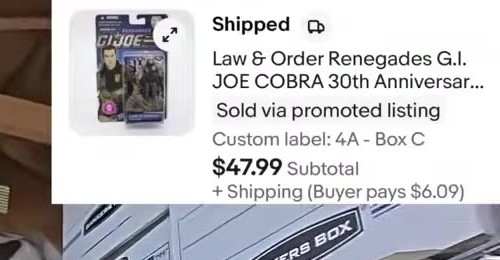
  <figcaption>
    eBay
    Law &amp; Order Renegades G.I. Joe Cobra 30th Anniversary
    $47.99
  </figcaption>
</figure>

<figure class="sold-item">
  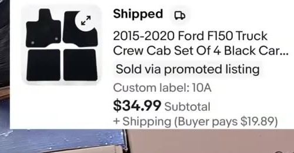
  <figcaption>
    eBay
    2015–2020 Ford F-150 Crew Cab Set of 4 Black Carpet Floor Mats
    $34.99
  </figcaption>
</figure>

<figure class="sold-item">
  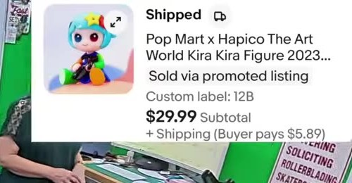
  <figcaption>
    eBay
    Pop Mart x Hapico The Art World Kira Kira Figure 2023
    $29.99
  </figcaption>
</figure>

<figure class="sold-item">
  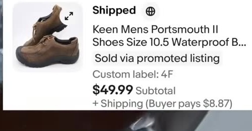
  <figcaption>
    eBay
    Keen Mens Portsmouth II Waterproof Shoes, Size 10.5
    $49.99
  </figcaption>
</figure>

<figure class="sold-item">
  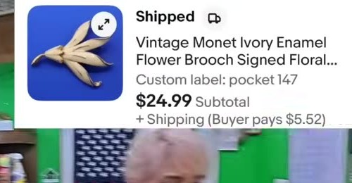
  <figcaption>
    eBay
    Vintage Monet Ivory Enamel Flower Brooch (signed)
    $24.99
  </figcaption>
</figure>

<figure class="sold-item">
  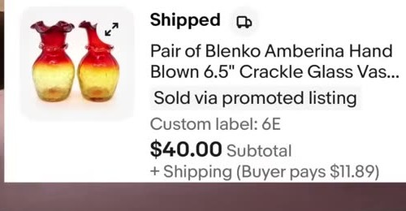
  <figcaption>
    eBay
    Pair of Blenko Amberina Hand-Blown 6.5" Crackle Glass Vases
    $40.00
  </figcaption>
</figure>

<figure class="sold-item">
  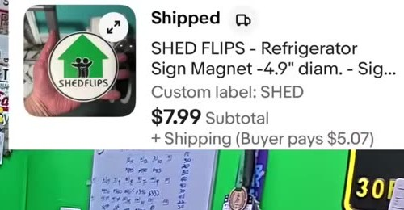
  <figcaption>
    eBay
    Shed Flips Refrigerator Sign Magnet, 4.9" diameter
    $7.99
  </figcaption>
</figure>

<figure class="sold-item">
  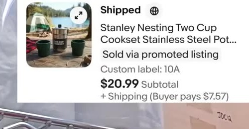
  <figcaption>
    eBay
    Stanley Nesting Two-Cup Cookset, Stainless Steel
    $20.99
  </figcaption>
</figure>

<figure class="sold-item">
  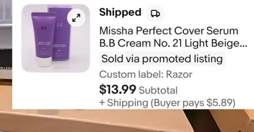
  <figcaption>
    eBay
    Missha Perfect Cover BB Cream No. 21 Light Beige
    $13.99
  </figcaption>
</figure>

<figure class="sold-item">
  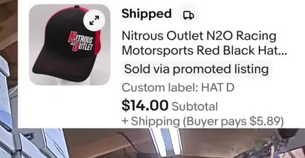
  <figcaption>
    eBay
    Nitrous Outlet N2O Racing Motorsports Red/Black Hat
    $14.00
  </figcaption>
</figure>

<figure class="sold-item">
  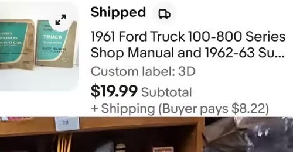
  <figcaption>
    eBay
    1961 Ford Truck 100–800 Series Shop Manual + 1962–63 supplement
    $19.99
  </figcaption>
</figure>

<figure class="sold-item">
  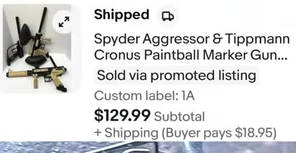
  <figcaption>
    eBay
    Spyder Aggressor &amp; Tippmann Cronus Paintball Marker Gun (lot)
    $129.99
  </figcaption>
</figure>

<figure class="sold-item">
  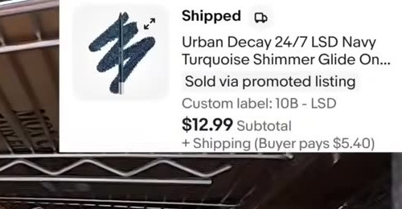
  <figcaption>
    eBay
    Urban Decay 24/7 LSD Navy Turquoise Shimmer Eyeliner
    $12.99
  </figcaption>
</figure>

<figure class="sold-item">
  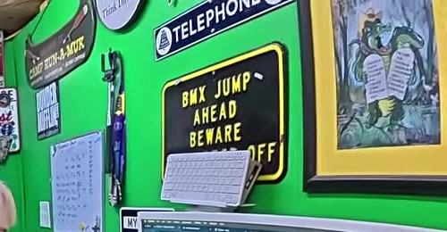
  <figcaption>
    eBay
    Vintage Anheuser-Busch Eagle Logo Brass Belt Buckle
    $9.99
  </figcaption>
</figure>

<figure class="sold-item">
  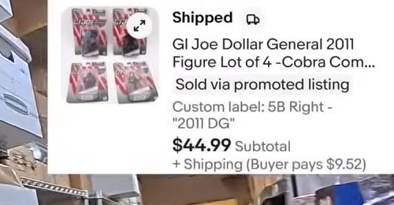
  <figcaption>
    eBay
    GI Joe Dollar General 2011 Figure Lot of 4 — Cobra Commander
    $44.99
  </figcaption>
</figure>

<figure class="sold-item">
  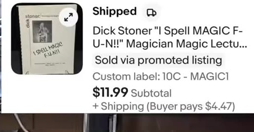
  <figcaption>
    eBay
    Dick Stoner <em>I Spell MAGIC F-U-N!</em> Magician Magic Lecture
    $11.99
  </figcaption>
</figure>

<figure class="sold-item">
  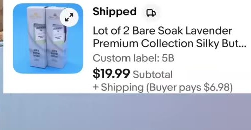
  <figcaption>
    eBay
    Lot of 2 Bare Soak Lavender Premium Collection Silky Butter
    $19.99
  </figcaption>
</figure>

**eBay subtotal: $812.79 across 24 sales** — and the 35mm film trailer lot you see at the top of that grid actually sold *twice* in the same morning, to two different buyers, both at $74.99. That's a multi-quantity listing earning its keep. (We packed them a little smaller the second time around — the shipping math gets ugly when the lot is big.)

A few specific things worth pulling out of those cards:

The **US Army sweatpants** are still moving. We've sold a stack of these, and there are twelve pairs of size 2XL still on the shelf. They're bulky — not because of the size, just thick fabric — so storage is the limiting factor more than demand. $19.99 a pair is a steady single, not a home run.

The **Free People high-heel clogs** went for $29.99. Candice would've kept them if they'd been her size. (Speaking of which, I came out to the shed Friday and found a pair of brand-new New Balance hiking shoes that were exactly *my* size in the unlisted pile. They're mine now. As Candice put it: if you're going to steal from your inventory, you might as well steal from the death pile.)

The **Keen Portsmouth II shoes** at $49.99 surprised me. We picked them up the weekend before last and didn't have a clear comp at the time — the brand is decent but I wasn't sure what the going rate was on a used pair. New, those would be roughly $100. Waterproof leather lace-ups with a big rubber toe cap, men's 10.5. They moved fast.

The **Spyder Aggressor & Tippmann Cronus paintball marker lot** at $129.99 was a strategic call I'm glad I made. We bought them as a pair at a good price, and I didn't really want to mess with them — testing, photographing, listing each separately — so I sold them as a single lot. Yes, we left some money on the table. We do that often. In this case the speed was worth more than the maximum.

The **Pop Mart x Hapico Kira Kira figure** is a blind box, which means the photo on the listing isn't necessarily the figure that's in the box. The buyer got *cuter*. Our listings are honest about that — Pop Mart figures are luck of the draw and the photo is the line art, not the contents.

The **Shed Flips refrigerator magnet** was the eight-pack run we 3D-printed in the shed — the printers paid for themselves out of channel merch a while back, and these magnets are part of the keep-them-busy queue. One went out to Brad. Hi, Brad.

The **Urban Decay 24/7 eyeliner in "LSD"** is part of a stockpile of one model in different colors. We've moved a lot of them. Eighteen still in inventory. Color names get edgy on this brand — *LSD*, *Sweet*, *Fungus* — which led, somehow, to me announcing I was simultaneously 3D-printing a mushroom while we were pulling that order. Candice noted that joke worked on three levels. I'm going to take the credit even though half of it was an accident.

## The Poshmark sale

<figure class="sold-item">
  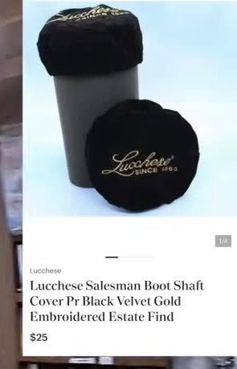
  <figcaption>
    Poshmark
    Lucchese Salesman Boot Shaft Cover, Black Velvet, Gold Embroidered (Estate Find)
    $25.00
  </figcaption>
</figure>

One Poshmark sale this batch. The Lucchese (which I always pronounce "Lucasy" because I cannot get my mouth around the actual Italian) salesman boot shaft cover sold for $25. It was a vintage piece from an estate find — gold embroidered, black velvet, the kind of piece that belongs on a display boot at a Western-wear shop. Last pair we had in that lot, and we didn't know it had even sold until I went to pull it. That's the magic of "set and forget" listings — sometimes the platform just *moves things*.

## The Mercari sale

<figure class="sold-item">
  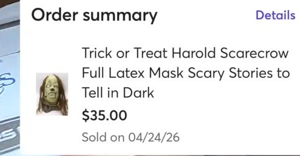
  <figcaption>
    Mercari
    Trick or Treat Harold Scarecrow Full Latex Mask (<em>Scary Stories to Tell in the Dark</em>)
    $35.00
  </figcaption>
</figure>

Mercari was a bit of an adventure. We tried to pull the order and got a 500 internal server error — the platform had logged us out and the API was unhappy. We worked around it and got the order on the second try.

The item: a Trick or Treat Studios full latex Harold the Scarecrow mask, from *Scary Stories to Tell in the Dark*. That movie was creepy in a specific way that doesn't apply to most horror — the kind that lingers. The mask is one of those licensed pieces that has a specific buyer and patiently waits. Sold for $35 on April 24th. (Worth noting: there's a non-zero chance these Halloween-cycle pieces sell *better* in their off-season — the buyers who really want them aren't shopping in October when prices are high. Candice's exact words: *"these might all sell out of season."*)

The mask lived in 5A, which is *literally* the box labeled "Mask." Yes, we have a box that's a box of masks. Yes, it has a label that says Mask. The shed has a system.

## The Etsy windfall

<figure class="sold-item">
  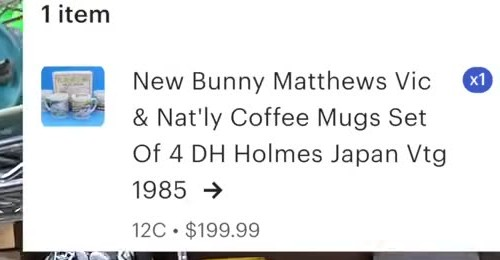
  <figcaption>
    Etsy
    New Bunny Matthews "Vic &amp; Nat'ly" Coffee Mugs Set of 4, DH Holmes, Japan, Vtg 1985
    $199.99
  </figcaption>
</figure>

The headline number of the morning. Etsy has been the surprise platform lately — Candice keeps saying *"man, Etsy was on fire"* and the numbers back her up. This one was a set of four Bunny Matthews "Vic & Nat'ly" coffee mugs, made in Japan in 1985 for the DH Holmes department store in New Orleans. Bunny Matthews was the New Orleans cartoonist who drew Vic and Nat'ly, the Yat couple from the Ninth Ward who were a long-running fixture in *Where Y'at?* magazine and the *Times-Picayune*. The mugs are deeply regional and deeply collectible — the kind of thing where Etsy is exactly the right buyer pool because Etsy buyers go looking for vintage by name.

Listed as a set of four. Sold as a set of four. $199.99 plus shipping.

For context: that single Etsy sale was about 25% of the entire eBay subtotal for the whole morning. One item. That's why Etsy is worth maintaining as part of the four-platform stack even when it's slow week-to-week — the hits, when they hit, are bigger.

## The numbers

| Platform | Items | Subtotal |
|---|---:|---:|
| eBay | 24 | $812.79 |
| Etsy | 1 | $199.99 |
| Mercari | 1 | $35.00 |
| Poshmark | 1 | $25.00 |
| **Total** | **27** | **$1,072.78** |

A little over a thousand bucks gross from one morning of pulling orders. eBay carried the volume; Etsy carried the value. Mercari and Poshmark both contributed exactly one sale each — which is roughly the cadence we expect from those two on a given day, and exactly why we bother to keep listings live there. One sale is one sale.

## What this morning taught us

The pattern that keeps showing up: **you don't need to source every weekend**. We hit it hard one day — Friday — and let the existing listings do the work for the next two. Monday morning's twenty-seven orders is what that decision looks like materialized. If we'd gone out Saturday too, we'd have come home with more inventory and the same pull-orders list, but we would've been more tired and the death pile would be bigger. There's a point past which buying more is just deferring listing work.

The other quiet lesson: **always check Etsy**. We almost overlook it some weeks. We almost did this week. And then a $199.99 set of regional vintage mugs reminds us why it's part of the four-platform stack.

## Useful references

- **eBay's sold-listings filter** — for comp research before listing anything similar (set the search to "Sold listings" only).
- **Terapeak** (built into eBay Seller Hub) — for actual median-sold-price data over time. Cleaner signal than just scrolling sold listings.
- **Poshmark's "share to followers"** mechanic — if you're not active on Poshmark, sales are slow; passive listings are the difference between "$25 in five months" and "$25 in five hours."
- **Mercari's category trees** — match yours to the right one. The platform's recommendations are aggressive but not always correct, and the wrong category buries a listing.

That was a good morning. Twenty-seven orders, one platform meltdown, and one $199.99 Etsy hit that we didn't know was coming.

Welcome back to the shed. We'll see y'all again very soon.
